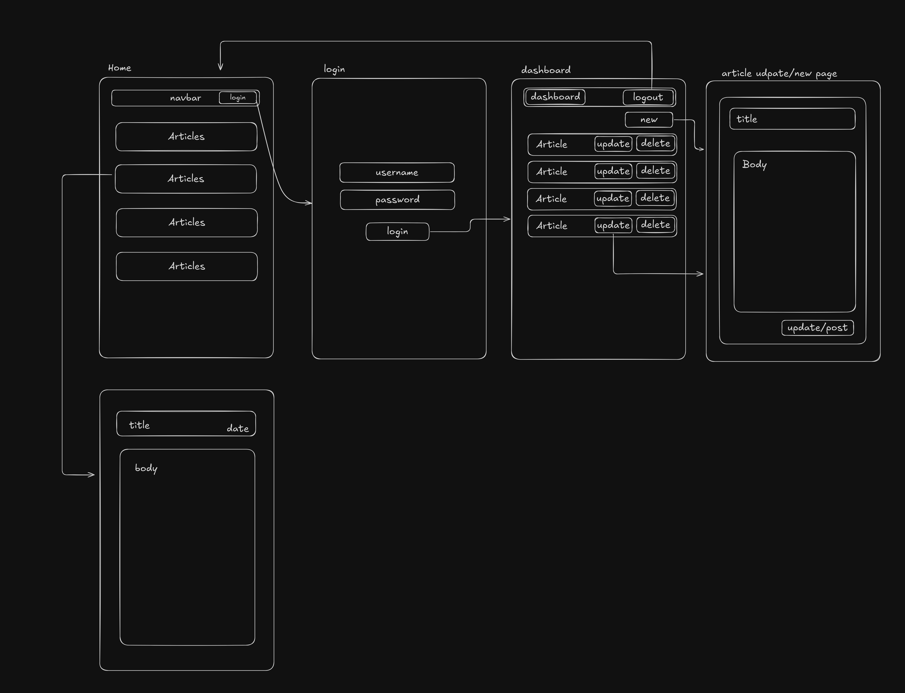

# Personal Blog


[Project](https://roadmap.sh/projects/personal-blog) from [Roadmap.sh](https://roadmap.sh/)

This is a simple personal blog built using Flask. It includes the following features:

- 🖊️ Create, edit, and delete articles.
- 🔒 Admin authentication for managing content.
- 🏷️ A clean and consistent UI using Tailwind CSS.

- 🖊️ Create, edit, and delete articles.
- 🔒 Admin authentication for managing content.

## Wireframe



## 🚀 Installation

1. **Clone the repository:**

   ```bash
   git clone https://github.com/yourusername/personal-blog.git
   cd personal-blog
   ```

2. **Run with Pipenv**

    ```bash
    pipenv run python main.py
    ```

## Demo

[Watch the demo](assets/demo.mp4)
